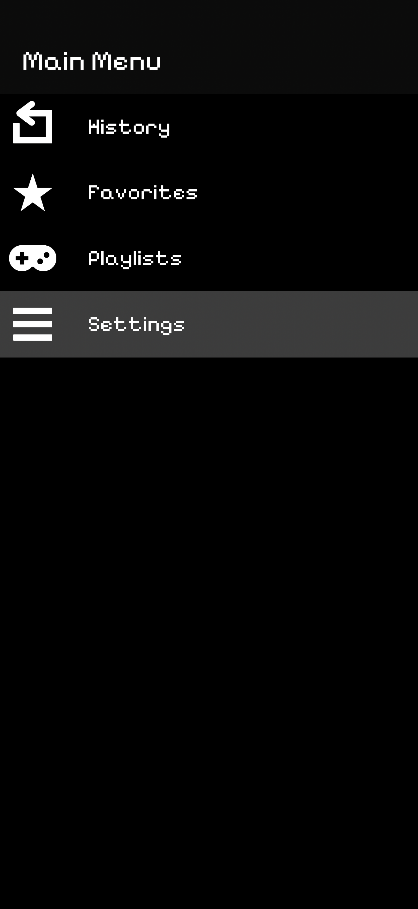
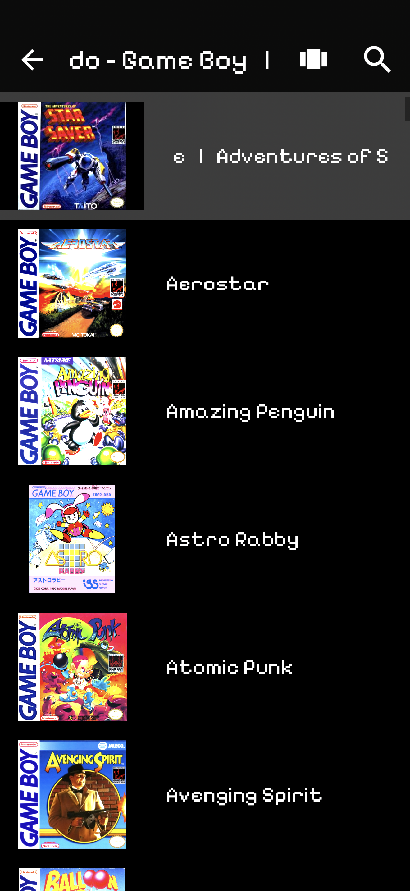

# Simple UI Theme and Short Setup guide for RetroArch (GLUI)
Hi Everyone
I created a set of RetroArch configs I call the Simple UI Theme for GLUI. I was inspired by interfaces like MiniUI.
The goal of this project is to simplify the RetroArch menu system into a focused interface for the rest of us. Part of the reason I did this is because the RetroArch iOS interface leaves a lot to be desired for first-time users—especially since it uses a very outdated version of Material Design.
There are still some rough edges, but I hope you enjoy this simple take on RetroArch. Also to prephace this, I have not invented anything. For all I know someone else has done something similar. Unfortuantly all the guides I find on the internet are mostly for XMB. XMB is cool and nice but its not great on a touch screen.

  
  
  

## Known Issues / Things I Don’t Know How to Fix

- **Date, time, and battery** are disabled because they look awful on an iPhone with a notch. If RetroArch ever adopts the iOS status bar, I’ll re-enable them.
- **Fullscreen notch feature** cuts off games. For now, I’ve opted to disable it.
→ Does anyone know how to move the game screen around in RetroArch?
- **Stupid input down arrow** - Does anyone know how to disable it? For God’s sake, even in Material Design, elements like this are supposed to be a circular plus sign at the bottom of the screen.
-**Menu highlights**. By default, menus highlight items without clicking (obviously for controller navigation).
→Is there a way to disable this?

## Things the Community Can Help With
-If someone has a per-console list with the optimal emulator/core, please let me know. I want to delete useless or outdated cores and create a list of recommended ones per console, so users don’t have to pick. Then I’ll upload “keep and delete” instructions.
I know not all cores are perfect for every game, but unless you’re a perfectionist, one good core usually works fine—especially for pre–6th gen consoles.
Please give simple yes/no answers, not tier lists or emoji-filled ranking charts.

-I’d really like to **rename the History and Playlists tabs** to Recents and Games. If anyone knows how, please let me know.
-If you’re a better graphic designer than me, please send me cool icons for this theme or make your own and share it! Eventually, I’d like better playlist icons for each console. For now, I’ve left them unchanged.
-If anyone has documentation or insights about theming GLUI, please send them my way. I’d like to tweak color settings so we can eventually have different font and theme color options.

## What’s Included in the GitHub (Download the Simple UI.zip)

- `retroarch.cfg` (my configuration file)  
- 'font.ttf' A retro font I got from google fonts called pixelify sans https://github.com/eifetx/Pixelify-Sans
- Updated asset icons
  
You can use my config file and just add the necessary assets to the correct locations. Keep in mind, though, you should still follow the setup steps below to get RetroArch and your playlists ready.

## Instructions
### 1. Set Up RetroArch (Skip this step if you have done this already)
**Step 1:** Download RetroArch.
**Step 2:** Go to Online Updater and click all of the following:
Update Core Info Files
Update Assets
Update Controller Profiles
Update Cheats
Update Databases
Update Overlays
Update Slang Shaders

#### Add Games:
There are multiple ways to do this. Retro Handhelds explains it well in their guide:
→ https://retrohandhelds.gg/retroarch-iphone-ipad-setup-guide/
They also explain how to set up shaders, which look really cool.

#### Basic setup:
**Step 1:** Create a ROMs folder and subfolders for each console and add roms. Place the roms folder inside the root of the RetroArch folder:  On This iPhone > RetroArch > RetroArch > ROMs

**Step 2:** In Retroarch 
-Click Import Content
-Choose Scan Directory
-Navigate to your ROMs directory and select Scan This Directory

### 2. Apply the Config
- Copy my `retroarch.cfg` file to:
On This iPhone > RetroArch > RetroArch > Config

(KEEP IN MIND YOU MAY NEED TO CHANGE THE SCALE FACTOR IF YOU HAVE A SMALLER IPHONE)

### Or, manually adjust your settings as follows:

#### User Interface
##### Appearance
- Scale Factor: 1.40x (This may need to be adjusted depending on your phone size. It looks good on my iphone 17 pro max but on a smaller screen you might want to do something smaller)
- Opacity: 0.800
- Color Theme: Gray Dark
- Icons: On
- Playlist Icons: On
- Show Navigation Bar: Off
- Portrait Thumbnails: List (Medium)
- Landscape Thumbnails: List (Medium)
- Ticker Speed: 3.2x
- Transition Animation: Slide
  
##### Menu Item Visibility (You can leave some on, but I turn these off for simplicity.)
- Load Core: Off
- Load Content: Off
- Import Content: Playlist Menu
- Playlists: On
- History: On
- Favorites: On
- Images: Off
- Music: Off
- Video: Off
- Explore: Off
- Netplay: Off
- Online Updater: Off
- Core Downloader: Off
- Information: Off
- Configuration File: Off
- Help: Off
- Date & Time: Off
- Battery Level: Off
- Core Name: Off
- Menu Sublabels: Off
  
##### On-Screen Notifications
- Turn off whatever you don’t want. I usually disable game startup notifications.

#### Playlist 
- History: On
- Set Hisotry Size to 10—this keeps it a real “recents” list instead of an endless one.
- I recommend turning off "Allow Remove Entries" to prevent accidental deletions.
  
#### Configuration,  
- Save Configuration on Quit : On (or manually save your configuration)
#### Quit RetroArch from the task switcher.
### 3. Copy Assets
- Copy the included icons and font file in the assets folder to:
On This iPhone > RetroArch > RetroArch > Assets > GLUI
- When prompted to replace files, click Replace.

## Final Notes

This project is a work in progress — but I hope it helps make RetroArch more approachable for new users, especially on iOS.  

If you have feedback, icons, theme tweaks, or documentation, please reach out or open a GitHub issue!  
